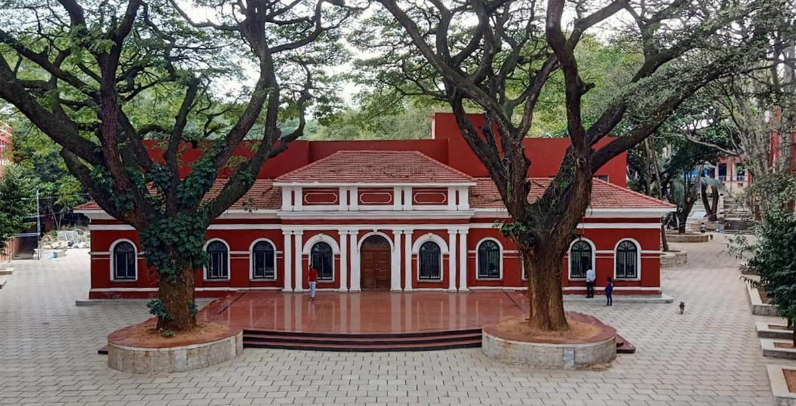

# MarvelBlog
## MARVEL

> *"Words may inspire but actions creates change!"* ~ **Simon Sinek**

**MARVEL** is a recently set-up R&D Laboratory in University Visveswaraya College of Engineering, Bangalore. It is a solely student run environment, 
funded by the alumni through the **UVCE Graduates Association** and is taken care by Mr. Satish, whom the students refer to as "Satish anna". It is located beside the library next to Minchu. It is a place where innovative and enthusiastic minds get together and work on projects and curate a syllabus for new learners. A system without any hierarchy, where all the students are trained to handle any given situation in the most diplomatic way possible.  

#### When and how it started?  

> *"A journey of a thousand miles begins with a single step."* ~ **Lao Tsu**

The club was inaugurated  on **15th September, 2021**, the *co-ordinators* have kept the lab up and running since then. On December, 2021 the first batch of *students* entered the lab after shortlisting about thirty out of a hundred applicants. The first batch officially ended the level one of their respective domains on June. (The above-mentioned roles will be briefly discussed below)

## Domains
There are **five domains** in MARVEL, out of which the students are allotted one. Each domain has *three levels* and each level contains *certain number of tasks*. The students are expected to complete their set of tasks and submit a report before the start of next batch. The domains are as follows:
- [IoT](https://hub.uvcemarvel.in/course/IOT-001) 
- [AI-ML](https://hub.uvcemarvel.in/course/AI-ML-001)
- [Design and Prototyping](https://hub.uvcemarvel.in/course/D-P-001)
- [Electric Vehicle and Reneewable Energy](https://hub.uvcemarvel.in/course/EV-RE-001)
- [Cloud Computing and Cyber Security](https://hub.uvcemarvel.in/course/CL-CY-001)

## Roles
#### 1. Co-ordinator  
This is the a**dministrative** and **management** role in MARVEL. A wide variety of tasks fall under this category, to name a few, inventory management, keeping record of the students' progress and ensuring their attendance, drafting letters and broadcast messages for events, forming the syllabi, troubleshooting errors and a lot more. Every co-ordinator is a representative, a **brand ambassador of MARVEL** itself. 
#### 2. Student  
A student is the "learner's role', the people who wish to get to know and dive deep into one of the listed above domains. They are expected to complete their given set of tasks and submit a report when a term ends. 
#### 3. Project-Team (in progress)
This set of people are expected to work on a project and submit weekly updates. To be accepted as one, a project proposal is made and on approval of the UVCEGA they are allotted funds and kept an eye on.

## Contact and Social Media
[website](https://hub.uvcemarvel.in/)  
<uvcemarvel@gmail.com>  
[Linkedin](https://www.linkedin.com/company/uvcega/)  
[Instagram](https://www.instagram.com/visionuvce/)
